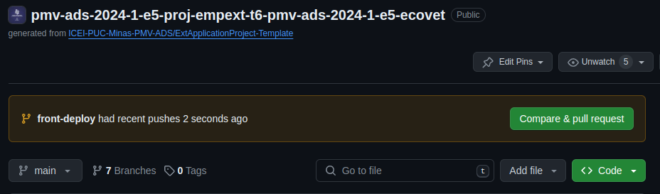
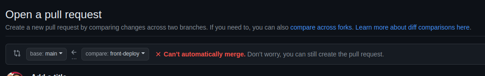

# Desenvolvendo

Tudo que seguir nesse formato `FORMATO_PRA_TROCAR_TEXTO` é para te atentar a trocar tudo que esta em caixa alta pro texto que você escolher. 


# Desenvolvendo no BACK

## Git

> Lembre-se de trocar o NOME_DA_BRANCH para o nome escolhido por você, não pode ter espaço

> Lembre-se de trocar o MENSSAGEM_NO_COMMIT para o nome escolhido por você, não pode ter espaço

### Antes de começar a desenvolver, crie uma nova branch

```
git checkout -b feature/back/NOME_DA_BRANCH
```

### Após terminar de desenvolver siga os passos abaixo:


```
git add .

git commit -m 'MENSSAGEM_NO_COMMIT'

```

### Se for seu primeiro commit na branch:

```
git push --set-upstream origin feature/back/NOME_DA_BRANCH

```

###  Se já fez outros commits na branch

```
git push --set-upstream origin feature/back/NOME_DA_BRANCH

```


> Ao terminar faça o `Pull Request` entrando na página do repositório, lá vai ficar evidente que tem a possibilidade um `Pull Request`, confira abaixo como fazer

## Codando no back

..

# Desenvolvendo no FRONT

## Git

> Lembre-se de trocar o NOME_DA_BRANCH para o nome escolhido por você, não pode ter espaço

> Lembre-se de trocar o MENSSAGEM_NO_COMMIT para o nome escolhido por você, não pode ter espaço

### Antes de começar a desenvolver, crie uma nova branch

```
git checkout -b feature/front/NOME_DA_BRANCH
```

### Após terminar de desenvolver siga os passos abaixo:


```
git add .

git commit -m 'MENSSAGEM_NO_COMMIT'

```

### Se for seu primeiro commit na branch:

```
git push --set-upstream origin feature/front/NOME_DA_BRANCH

```

###  Se já fez outros commits na branch

```
git push --set-upstream origin feature/front/NOME_DA_BRANCH

```

> Ao terminar faça o `Pull Request` entrando na página do repositório, lá vai ficar evidente que tem a possibilidade um `Pull Request`, confira abaixo como fazer

## Codando no front

Quando for rodar a primeira vez depois que clonou o repositório:

```
npm i

```

Sempre que estiver codando, pra ver o que esta fazend:

```
npm run start

```


# Como fazer um Pull Request
Ao entrar no link do repositório

https://github.com/ICEI-PUC-Minas-PMV-ADS/pmv-ads-2024-1-e5-proj-empext-t6-pmv-ads-2024-1-e5-ecovet

Se subiu direitinho, vai aparecer como a imagem abaixo:


> Note que pode haver mais de uma, mexa na sua!

Passos:
- Clique em `Compare & pull request` 
- Note que em base deve ser `main` e em compare precisa estar o nome da sua branch e em verde que pode fazer o merge

- Clique em `Create pull request`
- Espere tudo rodar
- Clique em `Merge Pull Request`
- Clique em